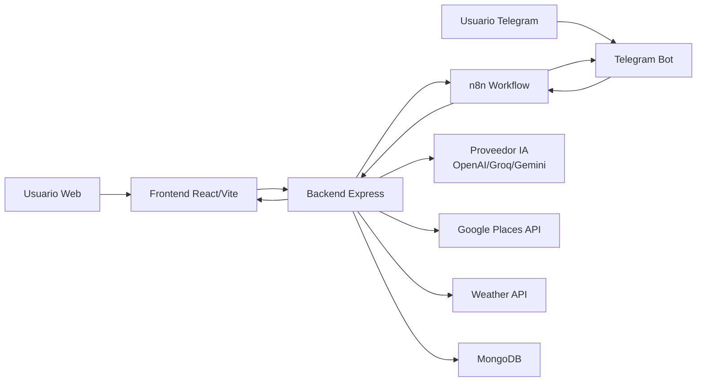
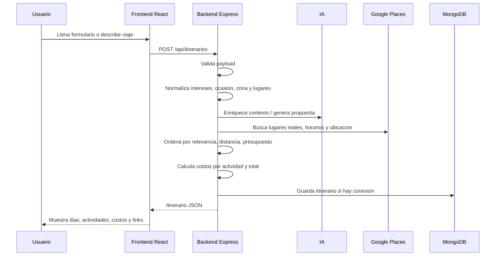
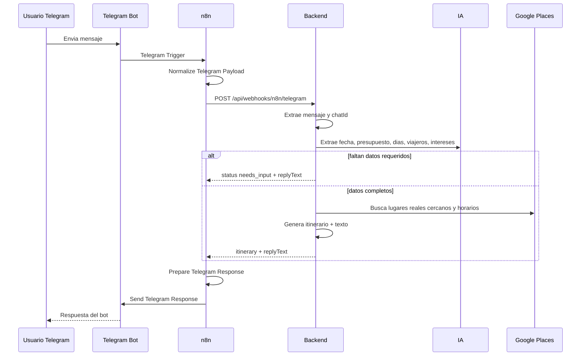
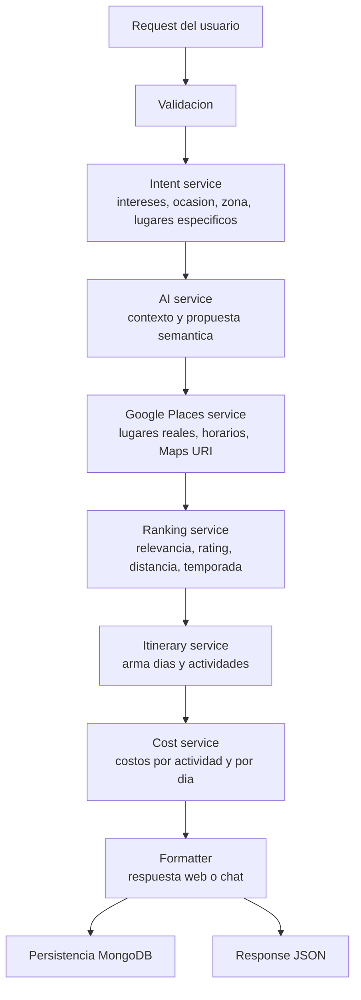

# Reporte tecnico del sistema Adventure-sv

Fecha de referencia: 2026-07-05  
Repositorio local: `C:\Adventure-sv`

## 1. Resumen ejecutivo

Adventure-sv es un sistema para generar itinerarios turisticos personalizados en El Salvador. El usuario puede pedir una ruta desde la web o desde canales conversacionales como Telegram, y el backend genera una propuesta con lugares reales, presupuesto estimado, horarios, enlaces de Google Maps y recomendaciones por dia.

El sistema combina:

- Frontend web en React/Vite.
- Backend Node.js/Express.
- MongoDB/Mongoose para persistencia.
- OpenAI/Groq/Gemini como proveedores de IA configurables.
- Google Places API para lugares reales, ubicaciones, horarios y estado de apertura.
- n8n como orquestador externo para Telegram y potencialmente WhatsApp.
- Telegram Bot API como canal conversacional actual.

El objetivo principal es recibir una solicitud flexible del usuario, extraer datos utiles del texto, enriquecerla con IA y Google Places, ordenar lugares relevantes y devolver un itinerario accionable.

## 2. Tecnologias y herramientas

### Frontend

- React 19.
- Vite 6.
- Tailwind CSS.
- React Router.
- Leaflet / React Leaflet para mapas.
- Lucide React para iconos.
- Fetch API para consumir el backend.

Entrada principal:

- `frontend/src/App.jsx`
- `frontend/src/pages/PlannerPage.jsx`
- `frontend/src/services/itineraryApi.js`

Componentes relevantes:

- `TripForm.jsx`: captura preferencias del viaje.
- `ItineraryResult.jsx`: muestra resultado.
- `DayTimeline.jsx`: renderiza dias y actividades.
- `ActivityCard.jsx`: muestra actividad, costo, estado, link de Google Maps, direccion y horarios.
- `BudgetSummary.jsx`: resumen de presupuesto.

### Backend

- Node.js con ES Modules.
- Express 4.
- Mongoose 8.
- dotenv.
- CORS.

Entrada principal:

- `backend/src/server.js`
- `backend/src/app.js`

Rutas:

- `GET /api/health`
- `POST /api/itineraries`
- `POST /api/webhooks/whatsapp/itineraries`
- `POST /api/webhooks/n8n/whatsapp`
- `POST /api/webhooks/n8n/telegram`
- `POST /api/webhooks/n8n/chat`

Servicios principales:

- `itinerary.service.js`: orquestacion central del itinerario.
- `ai.service.js`: comunicacion con proveedor IA y parsing/enriquecimiento.
- `intent.service.js`: extraccion local de intereses, ocasion, zona preferida y lugares especificos.
- `googlePlaces.service.js`: busqueda de lugares, Google Maps, horarios y sesgo geografico.
- `ranking.service.js`: puntuacion de lugares por relevancia, distancia, rating, temporada y ocasion.
- `cost.service.js`: estimacion de costos, gasto por actividad y breakdown diario.
- `n8nWhatsapp.service.js`: adaptador para mensajes desde n8n, WhatsApp, Telegram y chat.
- `whatsappFormatter.service.js`: formatea respuesta conversacional.
- `season.service.js`: reglas de temporada.
- `occasion.service.js`: reglas por ocasion.

### Base de datos

MongoDB via Mongoose.

Modelos:

- `Itinerary`
  - `channel`: `web`, `whatsapp`, `telegram`.
  - `phone`: identificador del usuario o chat.
  - `request`: payload original.
  - `summary`: resumen textual.
  - `context`: contexto interpretado.
  - `budgetUsd`.
  - `estimatedCostUsd`.
  - `adjustments`.
  - `days`.

- `Conversation`
  - `channel`: `web`, `whatsapp`, `telegram`.
  - `phone`: identificador del chat o telefono.
  - `status`: `active`, `closed`.
  - `messages`: historial simple.
  - `lastItineraryId`.

Otros modelos disponibles:

- `Season`
- `PromotedPlace`
- `OccasionRule`

### Integraciones externas

- OpenAI/Groq/Gemini: generacion y extraccion semantica.
- Google Places API: lugares reales, direccion, Maps URI, horarios, estado abierto/cerrado.
- Weather API: clima, si esta configurada.
- n8n Cloud: workflow conversacional.
- Telegram Bot API: entrada y salida de mensajes.
- Render: despliegue del backend.

## 3. Variables de entorno

Backend:

```env
PORT=4000
MONGODB_URI=mongodb://localhost:27017/adventure-sv
GOOGLE_MAPS_API_KEY=
WEATHER_API_KEY=
AI_PROVIDER=openai
AI_API_KEY=
AI_MODEL=gpt-4o-mini
FRONTEND_URL=http://localhost:5173
SKIP_DB_CONNECTION=false
NODE_ENV=development
```

Frontend:

```env
VITE_API_URL=http://localhost:4000
```

n8n:

```env
ADVENTURE_SV_API_URL=https://adventure-sv.onrender.com
```

Telegram:

- Token creado en BotFather.
- Credencial configurada dentro de n8n.
- El trigger de Telegram recibe mensajes y dispara el flujo.

## 4. Arquitectura general



El backend es el centro del sistema. La web lo consume directamente. Telegram no llama al backend directamente; pasa primero por n8n, que normaliza el mensaje, llama al backend y luego envia la respuesta al chat.

## 5. Flujo web



Payload web tipico:

```json
{
  "channel": "web",
  "message": "Quiero playas cerca del aeropuerto",
  "interests": ["playa", "comida"],
  "budgetUsd": 400,
  "days": 3,
  "startDate": "2026-07-18",
  "travelers": 2,
  "preferredZone": "La Libertad",
  "occasion": "romantic"
}
```

## 6. Flujo Telegram con n8n



Campos requeridos en mensajes conversacionales:

- Presupuesto aproximado en dolares.
- Cantidad de dias.
- Fecha de inicio.
- Cantidad de viajeros.

Si falta informacion, el backend devuelve:

```json
{
  "success": true,
  "status": "needs_input",
  "missingFields": ["presupuesto aproximado en dolares"],
  "replyText": "Para armarte una ruta real necesito estos datos..."
}
```

## 7. Flujo interno de generacion del itinerario



Reglas importantes:

- Si el usuario pide una zona especifica, el backend intenta usarla como `preferredZone`.
- Google Places aplica sesgo geografico con radio aproximado de 12 km y fallback de 20 km.
- Si el usuario menciona un lugar especifico, se intenta priorizarlo.
- El ranking penaliza lugares lejanos cuando existe distancia calculada.
- El sistema intenta completar dias cuando la IA devuelve pocos resultados.
- Los costos son heuristicas internas, no precios oficiales.

## 8. Respuesta esperada del backend

Estructura general:

```json
{
  "success": true,
  "itinerary": {
    "summary": "Te arme un itinerario...",
    "budgetUsd": 400,
    "estimatedCostUsd": 350,
    "context": {
      "interests": ["playa", "comida"],
      "preferredZone": "La Libertad",
      "occasion": "romantic"
    },
    "days": [
      {
        "dayNumber": 1,
        "date": "2026-07-18",
        "title": "Dia 1 - La Libertad",
        "estimatedCostUsd": 100,
        "spendingOptions": [
          { "label": "Comida y bebidas", "amountUsd": 35 }
        ],
        "activities": [
          {
            "time": "10:00",
            "title": "Playa El Tunco",
            "category": "Playa",
            "estimatedCostUsd": 10,
            "spendingBreakdown": [
              { "label": "Entrada o consumo", "amountUsd": 10 }
            ],
            "googleMapsUrl": "https://maps.google.com/...",
            "address": "La Libertad",
            "openNow": true,
            "openingHours": ["domingo: 8:00-18:00"]
          }
        ]
      }
    ]
  },
  "replyText": "Texto listo para Telegram o WhatsApp"
}
```

## 9. n8n workflows

Archivos:

- `docs/n8n-adventure-sv-telegram.workflow.json`
- `docs/n8n-telegram-workflow.md`
- `docs/n8n-adventure-sv-whatsapp.workflow.json`
- `docs/n8n-whatsapp-workflow.md`

Workflow Telegram:

1. `Telegram Inbound Message`
   - Recibe mensajes desde el bot.
2. `Normalize Telegram Payload`
   - Extrae `chatId`, `text`, nombre y datos basicos.
3. `Call Adventure-sv Backend`
   - Hace `POST` a `${ADVENTURE_SV_API_URL}/api/webhooks/n8n/telegram`.
4. `Prepare Telegram Response`
   - Toma `replyText` o arma una respuesta corta.
   - Divide mensajes largos en partes.
5. `Send Telegram Response`
   - Envia la respuesta al `chatId`.

Punto critico: las credenciales del bot y la variable `ADVENTURE_SV_API_URL` deben configurarse manualmente en n8n.

## 10. Manejo de datos incompletos

El backend conversacional no genera itinerario si faltan campos obligatorios. En ese caso responde con instrucciones claras.

Ejemplo de mensaje incompleto:

```text
Hola, quiero viajar a El Salvador.
```

Respuesta esperada:

```text
Para armarte una ruta real necesito estos datos:
- presupuesto aproximado en dolares
- cantidad de dias
- fecha de inicio
- cantidad de viajeros
Ejemplo: Quiero 3 dias desde 2026-07-24, somos 4 personas, presupuesto $600, nos gusta cultura y naturaleza.
```

Riesgo actual: aunque existe modelo `Conversation`, el flujo conversacional todavia depende mucho de que cada mensaje traiga toda la informacion. No hay una maquina de estados robusta para completar datos faltantes en varios turnos.

## 11. Seguridad actual

El backend tiene:

- CORS limitado por `FRONTEND_URL`.
- JSON body limit de `1mb`.
- Middleware de errores.
- Validacion basica del request de itinerarios.

Debilidades visibles:

- Los webhooks de n8n no tienen autenticacion propia por token compartido.
- No se ve rate limiting.
- No se ve control de abuso por chatId, IP o usuario.
- Un bot publico de Telegram puede consumir creditos de IA y Google Places si muchas personas lo usan.
- No hay firma/verificacion de origen para requests de n8n.
- No se observa sanitizacion avanzada contra prompt injection.

## 12. Observabilidad y operacion

Estado actual:

- Hay logs basicos por servidor.
- Existe `GET /api/health`.
- No se observa tracing por request.
- No se observa correlacion entre request web/n8n/backend/IA/Google.
- No se observa dashboard de errores.

Recomendado:

- Agregar `requestId` por solicitud.
- Loggear proveedor IA, duracion, tokens aproximados, cantidad de lugares consultados y errores externos.
- Registrar errores de Google Places y OpenAI sin exponer secretos.
- Medir tasa de `needs_input`, tasa de itinerarios exitosos y costo estimado por canal.

## 13. Debilidades y riesgos para analizar

### Producto y precision

- El usuario puede pedir zonas ambiguas o con typos, por ejemplo `ciudad marcella`; el sistema intenta corregir a `Marsella`, pero no hay confirmacion de confianza.
- Google Places puede devolver lugares lejanos o categorias raras si la busqueda textual no es precisa.
- El radio geografico esta hardcodeado aproximadamente en 12 km con fallback de 20 km.
- Si no hay suficientes resultados cercanos, el sistema puede rellenar con lugares menos relevantes.
- La IA puede ignorar instrucciones especificas si los candidatos no contienen el lugar exacto.
- Las temporadas pueden contaminar el texto si se aplican fuera de contexto.
- Los costos por actividad son estimados heuristically, no precios reales verificados.
- Horarios y `openNow` dependen de disponibilidad de Google Places; pueden faltar o estar desactualizados.

### Arquitectura

- `n8nWhatsapp.service.js` maneja WhatsApp, Telegram y chat; el nombre ya no representa toda su responsabilidad.
- El flujo conversacional esta acoplado a extraccion de texto + campos obligatorios, pero no a una conversacion multi-turno fuerte.
- El servicio de itinerario concentra mucha logica de orquestacion.
- No hay una capa explicita de proveedores externos con interfaces comunes para IA, Places y Weather.
- No hay caching de resultados externos.

### Seguridad y costos

- Webhooks publicos sin token pueden ser invocados por terceros.
- Telegram bot publico implica consumo abierto de IA/Google si no hay limites.
- No hay cuotas por usuario/chat.
- No hay proteccion contra spam ni mensajes extremadamente frecuentes.
- Los errores externos podrian causar respuestas incompletas o silenciosas.

### Calidad de software

- No se observan pruebas automatizadas.
- No hay tests unitarios para:
  - extraccion de intereses;
  - parsing de fechas como "hoy";
  - deteccion de presupuesto;
  - ranking por distancia;
  - formateo de Telegram;
  - costos por actividad.
- No hay tests de integracion para n8n/backend.
- No hay mocks formales para OpenAI/Groq/Gemini/Google Places.
- Riesgo de regresion alto al ajustar prompts o categorias.

### Despliegue

- Render puede dormirse si se usa plan gratuito, causando retrasos o timeouts.
- n8n puede fallar si `ADVENTURE_SV_API_URL` apunta a local o a una URL incorrecta.
- El frontend depende de `VITE_API_URL`; si queda local en produccion, falla.
- Las credenciales de n8n no viajan en el JSON exportado; deben configurarse manualmente.

## 14. Recomendaciones prioritarias

1. Proteger webhooks.
   - Agregar header `x-adventure-webhook-secret`.
   - Validarlo en `/api/webhooks/n8n/*`.
   - Configurarlo tambien en n8n.

2. Agregar rate limiting.
   - Limite por IP para web.
   - Limite por `telegram:<chatId>` para Telegram.
   - Bloqueo temporal ante abuso.

3. Crear estado conversacional real.
   - Guardar campos parciales en `Conversation`.
   - Preguntar solo lo que falta.
   - Combinar nuevos mensajes con contexto previo.

4. Mejorar geocoding.
   - Resolver zona a coordenadas con confianza.
   - Si hay baja confianza, pedir confirmacion.
   - Mostrar distancia aproximada de cada lugar respecto a la zona.

5. Agregar pruebas automatizadas.
   - Unit tests para `intent.service`, `ranking.service`, `cost.service`, `whatsappFormatter.service`.
   - Integration tests para `/api/itineraries` y `/api/webhooks/n8n/telegram`.

6. Cachear proveedores externos.
   - Cache por query/zona/categoria para Google Places.
   - TTL configurable.
   - Reduce costo y mejora velocidad.

7. Mejorar respuesta en Telegram.
   - Resumen corto primero.
   - Luego dias en mensajes separados.
   - O enviar link a resultado web completo.

8. Separar responsabilidades.
   - Renombrar `n8nWhatsapp.service.js` a algo como `chatWebhook.service.js`.
   - Separar adaptadores por canal.
   - Mantener `itinerary.service.js` como orquestador, pero extraer pasos complejos.

9. Agregar observabilidad.
   - `requestId`.
   - Logs estructurados.
   - Metricas de latencia, errores, costo y uso por canal.

10. Crear checklist de produccion.
   - Variables correctas.
   - Health check funcionando.
   - n8n apuntando a Render.
   - Bot Telegram activo.
   - MongoDB conectado.
   - Keys vigentes.

## 15. Preguntas utiles para otro analisis

- Como evitar que la IA invente lugares cuando Google Places no devuelve suficientes candidatos?
- Conviene que el backend genere itinerarios solo con candidatos reales de Google Places?
- Como deberia manejar el sistema una zona no encontrada o ambigua?
- Deberia existir una pantalla web publica para compartir itinerarios generados desde Telegram?
- Que limite diario por usuario/chat evita consumo excesivo de creditos?
- Que datos se deben persistir por privacidad y cuales no?
- Como evaluar automaticamente si una respuesta fue "cercana" al lugar pedido?
- Que proveedor de IA conviene segun costo, latencia y calidad para este caso?

## 16. Estado actual esperado del sistema

El flujo web deberia poder generar itinerarios completos con costos por actividad, links de Google Maps y horarios si las APIs estan configuradas.

El flujo Telegram deberia:

- Responder con datos faltantes si el mensaje no trae presupuesto, fecha, dias o viajeros.
- Generar itinerario si el mensaje trae los campos requeridos.
- Enviar respuesta usando n8n y Telegram Bot API.
- Dividir respuestas largas para evitar limites de Telegram.

El punto mas sensible actualmente es la precision geografica: cuando el usuario dice "cerca de X", el sistema debe garantizar que los lugares realmente esten cerca de X o pedir aclaracion si no puede confirmarlo.

